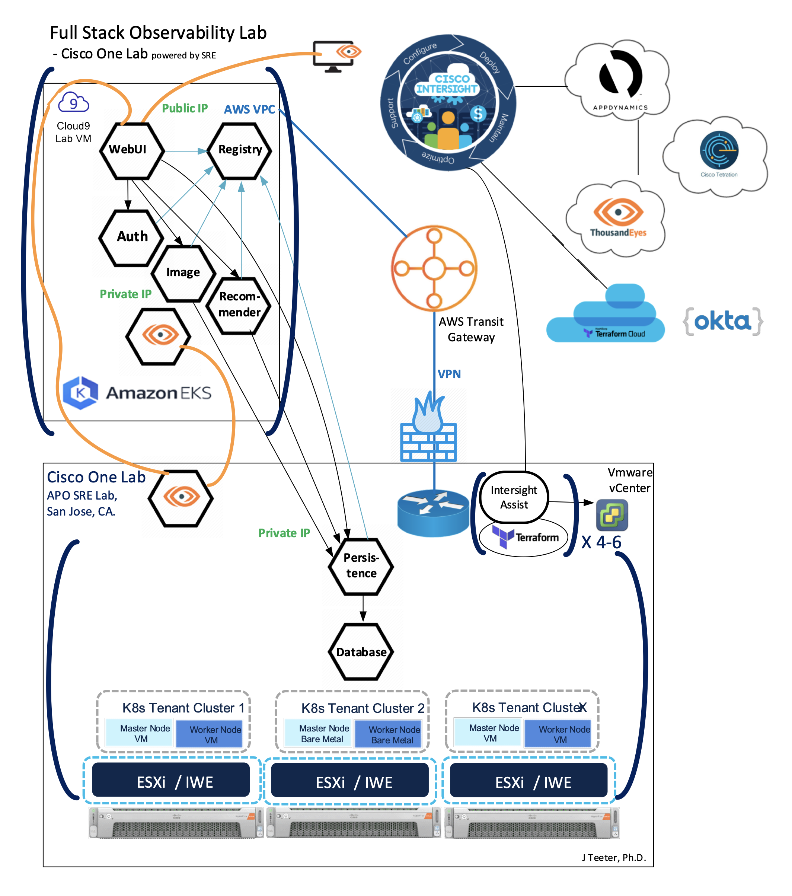

# AppD FSO Lab Intersight IKS

This code repository is a DevOps project that is a subset of the [FSO Lab DevOps](https://github.com/APO-SRE/fso-lab-devops) 
project. Its specific purpose is to help automate the deployment of Intersight IKS resources via Terraform for 
the Cisco Full Stack Observability (FSO) series of workshops for AppDynamics partners and customers.  

Although these Terraform code templates could be used in a stand-alone fashion, they are actually tightly 
integrated with the Cisco SRE [Terraform Cloud Workspaces](https://www.terraform.io/cloud-docs/workspaces) 
in order to trigger deployment of the Intersight workshop resources. As changes are committed to this repository, 
Terraform Cloud automatically initiates a new Plan action.

## FSO Architecture

Here is a diagram of the overall workshop architecture components including Intersight IKS:  

__FSO Lab DevOps: Architecture Overview__

